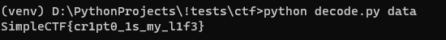

1. Скачиваем и открываем файл, нас встречает, на первый взляг, что-то не понятное и страшное.

    ```python
    '''我为伟大的中国党写了一个节目，为伟大而全能的习近平皇帝写了一个节目，我会得到一碗饭和一个额外的猫妻子。 这是一个程序将一个字母数字编码为另一个字母和另一个数字。🍚(˃ᆺ˂)🍚'''
    import sys
    from more_itertools import *
    盐之类的东西,神奇的数字,的=[0x78, 0x6F, 0x72],13,3#😹😹😹
    def 伟大的中国密码(档案名称, 数据资料):#😼
        编码数据=''
        for 数字机,记录块 in 数(grouper(数据资料,的,incomplete='fill',fillvalue=神奇的数字)):
            for 中国标志 in 记录块:
                ツ=(盐之类的东西[数字机%的])#😿
                if 数字机%的==0: 编码数据+=chr((中国标志-神奇的数字)^ツ)#🙀
                elif 数字机%的==1: 编码数据+=chr(中国标志^ツ)
                else: 编码数据+=chr((中国标志+神奇的数字)^ツ)
        with 的东(档案名称, "wb+") as file:
            file.write(编码数据.encode())
    if __name__=='__main__':
        if len(sys.argv)<的:
            print("使用方法: ./vnautkhe.py [档案] [数据资料]")
            exit()
        伟大的中国密码(sys.argv[1],sys.argv[2].encode(encoding="ascii"))
    ```

2. Для начала переведём всё на более понятный язык и сделаем понятней синтаксис

    ```python

    import sys

    from more_itertools import grouper

    chars = [0x78, 0x6F, 0x72]
    magic_number = 13
    n = 3

    def encode(filename, text):
        encoded_data = ''
        for i, block in enumerate(grouper(text, n, incomplete='fill', fillvalue=magic_number)):
            for char in block:
                value = (chars[i % n])
                if i % n == 0:
                    encoded_data += chr((char - magic_number) ^ value)
                elif i % n == 1:
                    encoded_data += chr(char ^ value)
                else:
                    encoded_data += chr((char + magic_number) ^ value)
        with open(filename, "wb+") as file:
            file.write(encoded_data.encode())
    if __name__ == '__main__':
        if len(sys.argv) < n:
            print("Usage: ./simpleCrypto.py [filename] [text]")
            exit()
        encode(sys.argv[1], sys.argv[2].encode(encoding="ascii"))

    ```

3. Разбираемся в простейшем алгоритме кодирования и пишем декодер

    ```python

    def decode(filename):
        with open(filename, "rb") as file:
            data = file.read()
        chars = [0x78, 0x6F, 0x72]
        magic_value = 13
        n = 3
        temp = ''
        for i, block in enumerate(grouper(data, n)):
            for char in block:
                value = chars[i % n]
                if i % n == 0:
                    temp += chr((char ^ value) + magic_value)
                elif i % n == 1:
                    temp += chr(char ^ value)
                else:
                    temp += chr((char ^ value) - magic_value)
        return temp

    ```

4. Запускаем и получаем флаг

    